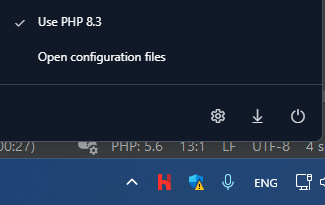

# geoSnaps

## Требования

- PHP >= 8.2
- Composer
- Node.js & NPM
- Herd (Желательно, очень желательно!)

## Настройка php.ini

Увеличьте размер файлов, которые можно загружать через формы, и увеличьте лимиты POST-запросов в вашем файле `php.ini`, который можете найти под этой кнопкой "Open configuration files"":


```ini
upload_max_filesize = 1000M
post_max_size = 1000M
```


## Установка

1. Склонируйте репозиторий с помощью git:

```bash
git clone -b tunel https://github.com/varsarius/GeoSnaps
```

2. Перейдите в каталог проекта:

```bash
cd GeoSnaps
```

3. Переименуйте файл .env.example в .env, а затем:


```
APP_NAME=geoSnaps

MAIL_MAILER=smtp
MAIL_HOST=sandbox.smtp.mailtrap.io
MAIL_PORT=2525
MAIL_USERNAME=2c055bc31cfca0
MAIL_PASSWORD=3939272182a13f
```
(можете использовать свои переменные серсиса https://mailtrap.io/)


4. Установите зависимости PHP с помощью composer:

```bash
composer install
```

5. Установите зависимости JavaScript с помощью npm:

```bash
npm install
```

6. Скопируйте файл `.env.example` и переименуйте его в `.env`, затем настройте свои переменные окружения.

7. Сгенерируйте ключ приложения:

```bash
php artisan key:generate
```

8. Запустите миграции базы данных и сиды:

```bash
php artisan migrate --seed
```

9. Соберите ваши ресурсы JavaScript и CSS:

```bash
npm run dev
```

## Запуск сервера

Запустите встроенный сервер Laravel с помощью команды:

```bash
php artisan serve
```

Теперь вы можете открыть свое приложение в браузере по адресу `http://localhost:8000`.

(Если используете laravel herd, то этот шаг лишний)
